# 170510 GET 과 POST on RAILS

이번 시간에는 **Ruby on Rails**의 **GET**과 **POST**에 대해 알아보았다.

먼저 코드를 짜기 전에 **GET**과 **POST**가 무엇인지 알아보자.

초록창에 "한양대학교"를 검색하고 주소창을 자세히 살펴보자.

---

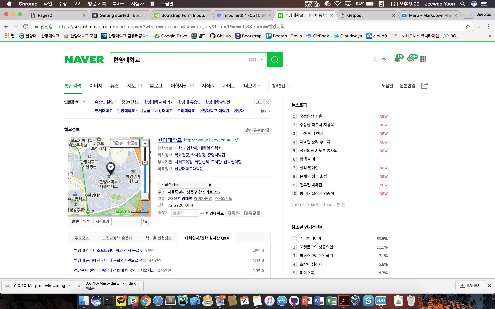

---

위와 같은 화면이 나오는데, 주소창을 자세히 보면

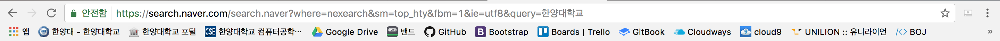

뭔가 알 수 없는 글자들이 나열되어있고, 그나마 구분할 수 있는 한양대학교라는 글자가 보인다.

**위는 GET방식으로 정보를 "GET"한 것이다. 말 그대로 정보를 가져왔다. 단, 위와 같은 GET요청을 보낼때에는 기본주소 이외에 추가적으로 저런 암호같은 글들을 써줘야 제대로 된 요청이 가능하다.**

무슨말인가 하면, 저 주소의 끝에 한양대학교를 없애고 서울대학교를 치고 결과를 보자.

---

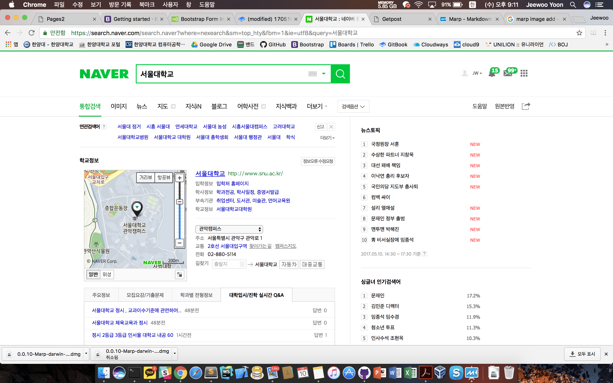

---

이렇듯 **GET방식은 정말 친절하다.** 너무 친절해서 주소의 구조를 잘 알고있는 사람에게는 누구든지 OPEN 되어 있다.

심지어 우리가 보여주고 싶지 않은 사람들에게 마저도..

그래서 그 반대의 개념이 **POST**이다. **POST는 정말 불친절하다.**

주소만 보아서는 내가 어떤 정보를 보고있는지 알 수가 없다. 그렇기 때문에 보안에 강하다.

내 ID와 비밀번호가 주소창에 뻔히 나오는 것보단 아무것도 안나오는게 더 안전하기 때문이다.

그럼 위의 내용을 이해하고 Rails를 신나게 달려보자.

먼저 전 시간에 배웠던 내용 그대로 Cloud9에서 rails project를 생성한다. \(필자는 Cloud9이 아닌 개인 컴퓨터 로컬 서버로 진행하였다.\)

우선 *Run Project*부터 해보자.

----

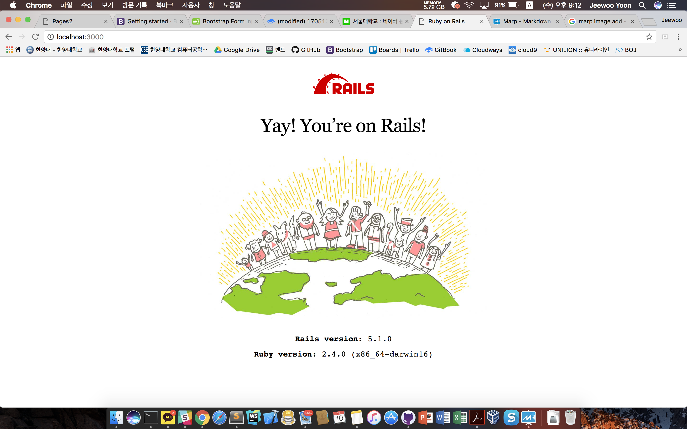

----

처음에 우리를 반기게 되는 화면은 그냥 저런 NO 의미의 화면이다.

지난시간에 배운대로 컨트롤러부터 만들어주자

`rails g controller home index`

라는 명령어를 터미널에 치게 되면 다음과 같이 명령어가 실행되면서 컨트롤러가 생성된다.

---

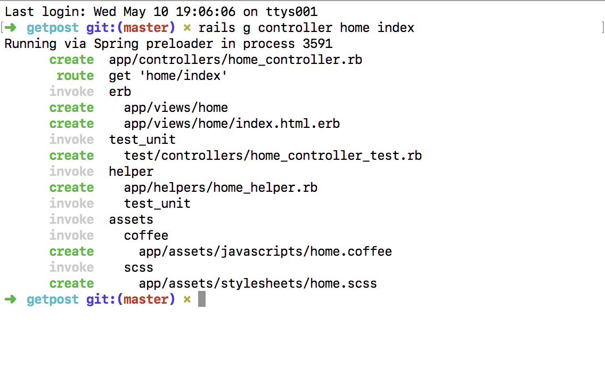

---

위의 명령어 하나로 home이라는 폴더에 index라는 html이 생겼고, controllers에 home이라는 이름을 가진 home_controller가 생겼다.

`app/views/home/index.html.erb`에 들어가보자.

```html
<h1>Home#index</h1>
<p>Find me in app/views/home/index.html.erb</p>
```
위와 같은 코드를 볼 수 있다.
그냥 run project를 하면 저 화면이 보이지 않으므로 `index.html.erb`를 **메인페이지**로 설정해보자.

---

`config/routes.rb`로 들어가보자.
```rails
Rails.application.routes.draw do
  get 'home/index'
end
```
위와 같은 코드를 볼 수 있다.

우선 우리는 `index.html.erb`를 우리의 메인페이지, 다르게 말하면 **root(루트)페이지**로 설정해야하므로 저 파일의 아무곳에나 `root 'home#index'`를 작성한다. 그 의미는 home 폴더의 `index.html.erb`를 **메인페이지**로 하겠다는 것이다.

---

### 그럼 다시 홈페이지로 돌아가서 새로고침을 해보자 그러면?!?!?

---

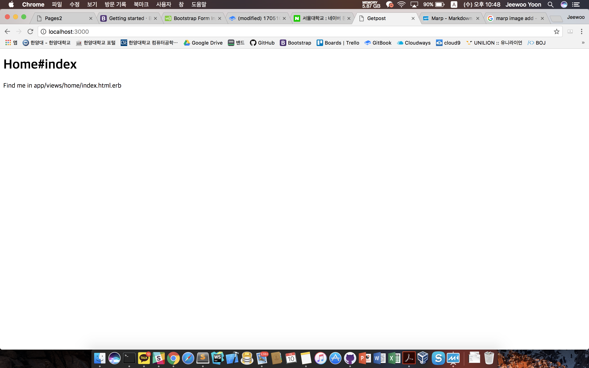

---

저렇게 `index.html.erb`가 메인페이지가 된것을 확인 할 수 있다.

## 근데 정말 안이쁘다.
우리가 오늘 만들것은 임시게시판인데 저런식으로 내용을 표시하면 아무도 쓰지 않을 것이고, 혼자쓰는 나도 짜증이 날 것이다. 그러니깐 우리를 도와줄 **갓(GOD)부트스트랩**을 이용하 프론트엔드를 이쁘게 만들어보자.

---

보통 부트스트랩을 사용을 하려면 실제로 부트스트랩 코드 전체를 다운받은 다음에 링크를 걸어주는 방식을 사용해야되는데, 번거로우므로 CDN을 이용하여 부트스트랩을 이용해보자.

>여기서 CDN이란? 그냥 하늘위에 떠다니는 부트스트랩이라고 생각하면 된다. CDN을 사용하면 부트스트랩을 다운받지 않고도, 주소만 씀으로써 원할때 하늘에 떠다니는 놈을 바로 끌어다 사용할 수 있다.

그럼 http://getbootstrap.com/getting-started/ 이곳으로 접속하여 Bootstrap CDN의 전체코드를 복사한다.

---

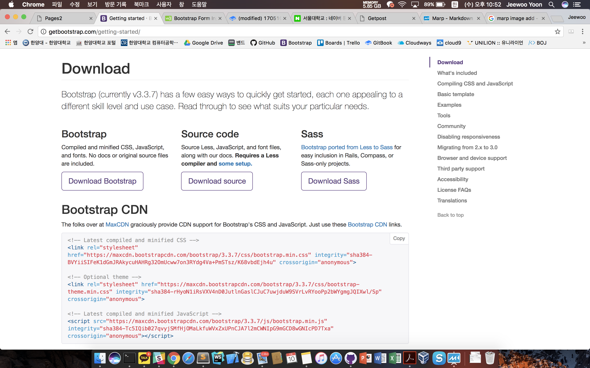

---

그리고 다시 Cloud9으로 돌아와서 `app/views/layouts/application.html.erb`에 코드를 복붙한다 
# 어디에? 여기에!
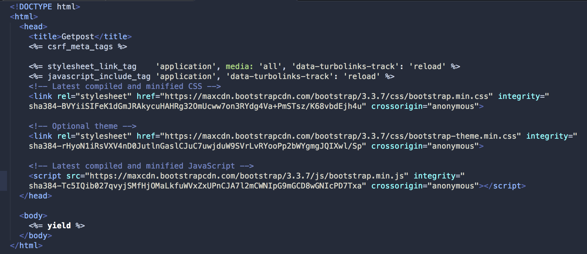

---

## 그렇다면 본격적으로 글 작성하는 페이지를 프리티하게 상큼하게 꾸며보자.

---

우선 다시 부트스트랩을 방문해서 이쁜 Form을 찾아보자!
http://getbootstrap.com/css/#forms GoGo!
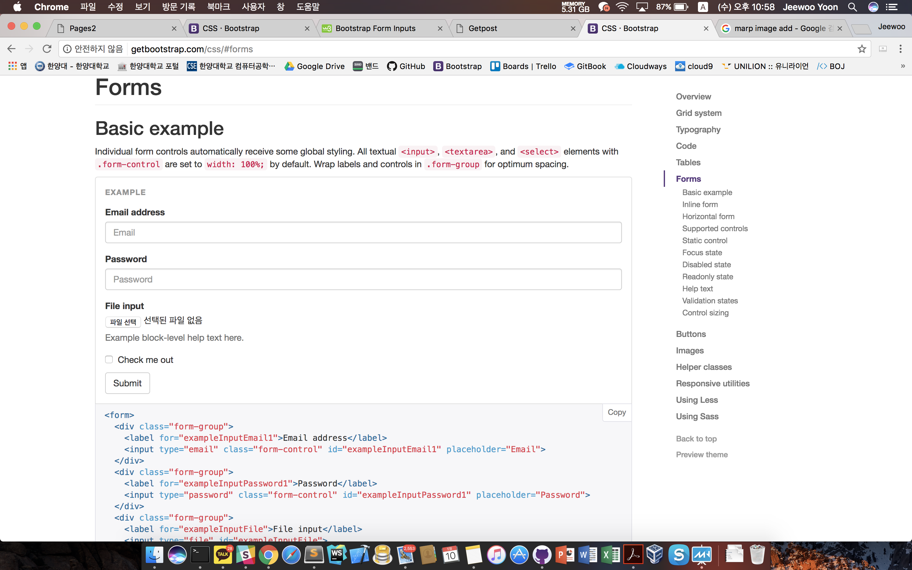

---

저기 있는 폼태그를 복붙해서 넣으면 되는데, 불필요한 내용이 많으므로 필자가 임의로 필요한 것들만 뽑은 코드를 보여주겠다.
```html
<div class="container">
<h1>게시글 작성</h1>
<form>
<div class="form-group">
<label for="exampleInputEmail1">글 제목</label>
<input type="text" class="form-control" name="title" placeholder="제목을 작성해주세요.">
</div>
<div class="form-group">
<label for="exampleInputPassword1">글 내용</label><textarea class="form-control" rows="5" name="text" placeholder="내용을 작성해주세요."></textarea>
</div>
<button type="submit" class="btn btn-default">글쓰기</button>
</form>
</div>
```
---
방금 전 슬라이드에서 보여줬던 그 코드를 `index.html.erb`에 시원하게 복붙을하고 페이지를 새로고침 해본다.
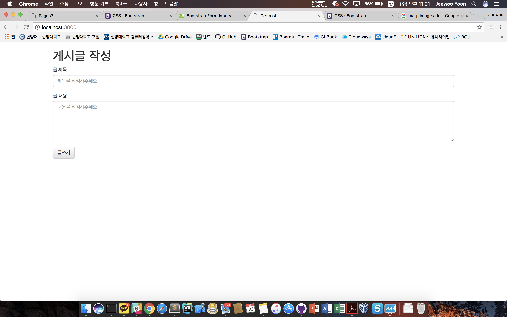

---
## 정말 깔끔하고 군더더기 없는 프론트엔드 디자인이 완성되었다! 자 이제 모든게 끝났으니 제목과 내용을 쓰고 글쓰기 버튼을 눌러보자!

---


# 아무일도 일어나지 않았다.

---

왜냐하면 이 프론트엔드 코드는 말그대로 Front에서만 동작하는 코드이기 때문이다. 사용자에게 보여지는 부분을 담당하기 때문에 버튼은 버튼일뿐 동작하지 않는다. 그러면 이제 저 버튼에 *생명을 불어넣어주자.* form태그에 다음과 같은 속성을 추가한다.
`<form action="/write" method="POST">`
이제 글쓰기 버튼을 누르게 되면 **POST**의 형태로 "/write" 주소에 정보를 보내게 될 것이다.

---

# 이제 정말 다 되었다.
# 글쓰기 버튼을 누르자!!!

---

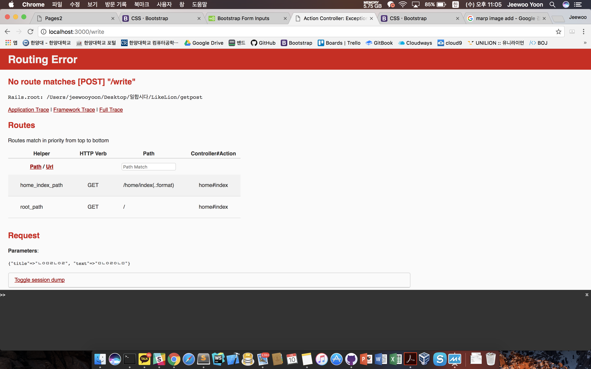
# 또 안돼!!!!!

---

잘생각해보니 **"/write"로 택배는 보냈는데 정작 주소지가 실제로 존재하지 않는 곳이였다! write에 해당되는 페이지도 만들어주지 않았고, 그에 따른 route도 지정해주지 않았다.** 다시 차근차근 만들어보자!

---

우선 `app/views/home/에 write.html.erb`를 만들어주자!
코드는 다음과 같이 임의로 쓰도록 한다.
```html
<div class="container">
   <h1>글작성완료</h1>
</div>
```
그리고 `config/routes.rb`에 들어가서
주소창에 "/write"로 **POST**요청이 들어왔을때 해당 페이지로 이동시켜줄 route를 만들어준다. 코드는 다음과 같다.
```rails
Rails.application.routes.draw do
  get 'home/index'
  root 'home#index'
  #추가한 코드
  post '/write' => 'home#write'
end
```

---

이제 저 코드로 인해서 주소창에 "/write"로 **POST**요청이 들어오게 되면, home 폴더의 `write.html.erb`가 화면에 뿌려지게 될 것이다.
확인해보자. 다시 메인페이지로 돌아가 글을 쓰고 글쓰기 버튼을 눌러본다.

---

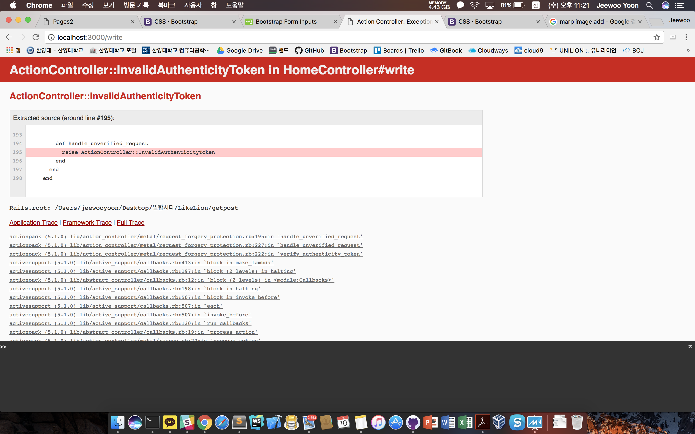

이건 뭐 장난하는 것도 아니고 또 안된다.

---

무슨 Token이 어떻게 됐다고 하는데, **팀장님의 말씀에 의하면 아직은 이 보안 처리에 대한 내용은 다루지 않을 것이라고 하니, 주석처리를 해줘서 해당 보안 기능을 지워준다.** `app/controllers/application_controller.rb`의 코드를 주석처리해준다. 다음과 같이.
```ruby
class ApplicationController < ActionController::Base
  #주석처리된부분 protect_from_forgery with: :exception
end
```
자 다시 메인페이지로 돌아가서 글을 쓰고 글쓰기를 눌러보자!!

---

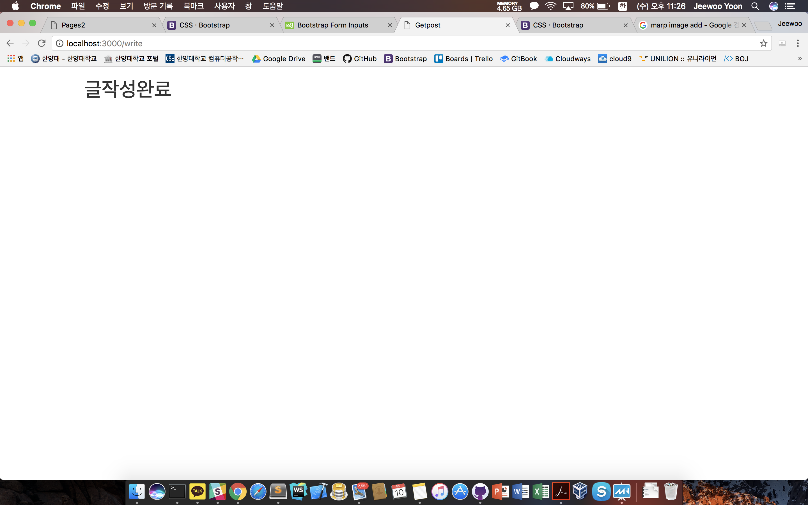

---

# 성공했다 ㅎㅎ
참고로 잠시 Delay가 발생하여 Token이 안된다고 뜰 수도 있으니 인내심을 가지고 글쓰기 시도를 여러번 해보자! 저장이 잘 되었는가 확인도 꼭!

---

하지만 우리가 원한건 이게 아니다. 우리가 원한건 글이 다음페이지에 써지는 건데, 눈 씻고 찾아봐도 내가 쓴 글의 제목과 내용을 다음페이지에서 찾을 수가 없다. 드디어 Controller를 사용할 때가 왔다. `controllers/home_controller.rb`로 가보자! 다음과 같이 코드를 수정한다.
```ruby
class HomeController < ApplicationController
  def index
  end
  def write
    @head = params[:title]
    @body = params[:text]
  end
end
```
 ---
 위의 코드에 설명을 덧붙이자면, **params라는 것은 parameter를 뜻한다. parameter는 인자라고도 불리는데, "넘겨진 값" 이라고 생각하면 쉽다.**
 POST요청방식으로 "/write"의 주소로 "넘겨진 값"은 당연 글의 제목과 글의 내용인데, 우리가 앞서 짠 `index.html.erb`의 코드를 자세히보면 input태그의 속성값중에 `name="title"` 혹은 `name="text"`라고 써진 것을 보게 될 것이다. 이렇게 앞에서 name을 정해주면, 그것이 곳 파라미터를 구분하는 변수명이 되는 것이다. 쨌든, title과 text라는 파라미터는 저런식으로 받을 수 있고, 이를 루비 변수 `@head`와 `@body`에 저장한다.
 
 ---
 
 그리고 다시 `write.html.erb`에 돌아가 다음과 같은 코드를 추가한다.
 ```html
 <div class="container">
   <h1>글작성완료</h1>
   <h2><%= @head %></h2>
   <h3><%= @body %></h3>
</div>
 ```
 
여기서 `@head`와 `@body`는 아까 `home_controller.rb`에서 선언한 값이다. 
이를 프론트로 다시 불러와서 화면에 뿌려주었다.

그럼 여기까지 모두 저장을 하고 다시 돌아가서 글을 쓰고 글쓰기를 눌러보자!

---

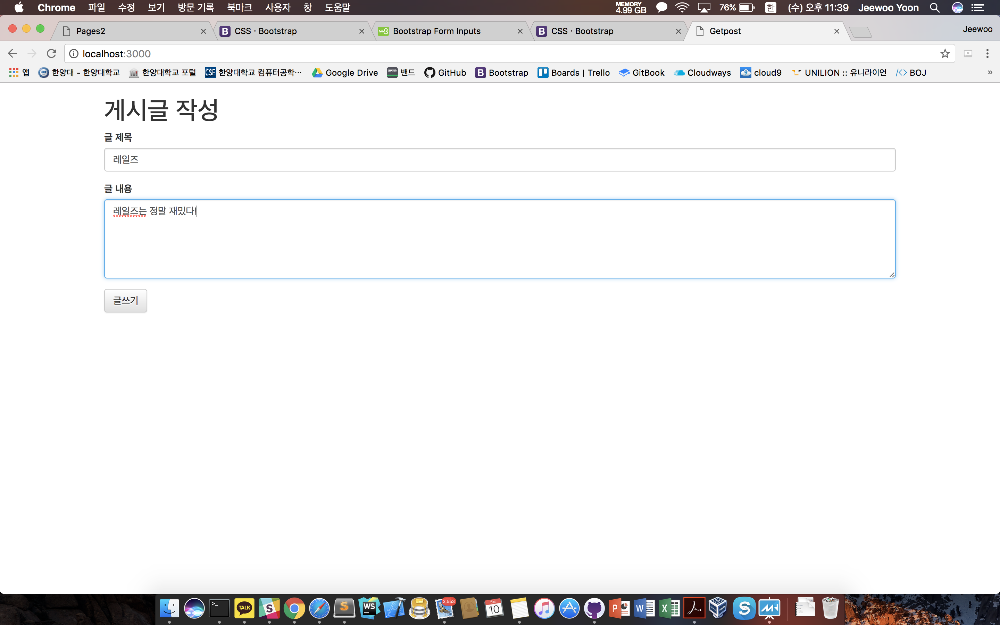

---

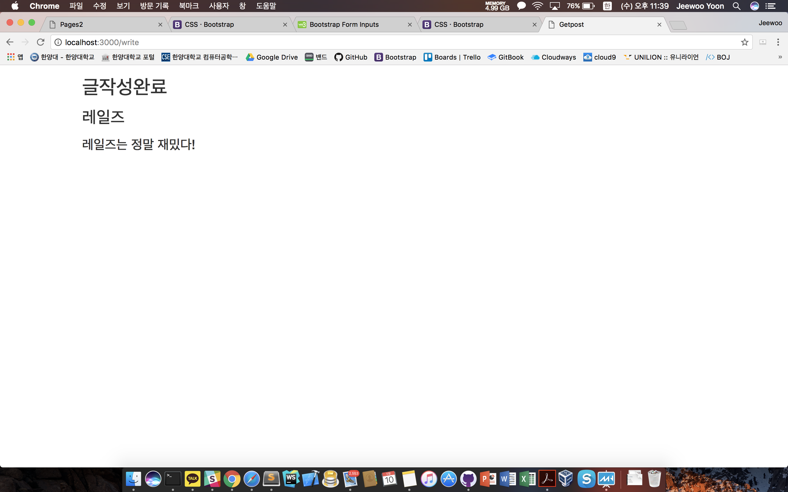

---

# 진짜로 끝!!!