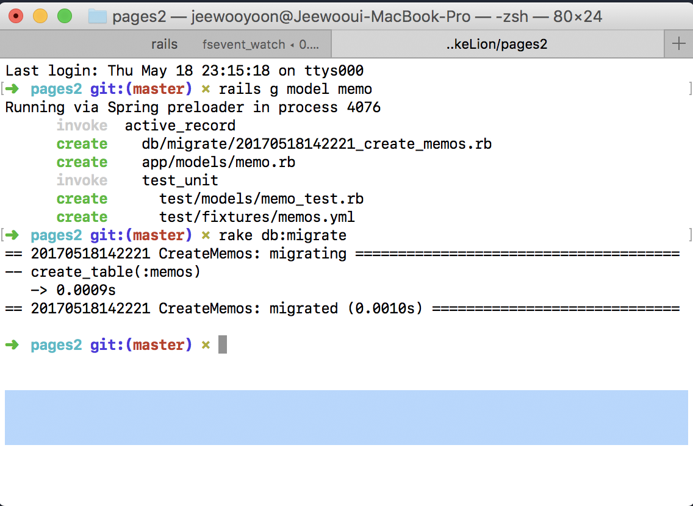

# 170517 C,R of CRUD

이번시간에는 **CRUD**에 대해서 살펴보았다. 
여기서 **CRUD**란, **C**reate **R**ead **U**pdate **D**elete의 약자로 웹 어플리케이션 개발의 기본이 되는 4가지 요소들을 칭한다.

기본적으로 **CRUD**를 하기 위해선 **Database**가 필요하다.
우선 **Database**가 무엇인지부터 개념을 잡아보자.

**Database**는 영구적으로 데이터를 담아두는 공간이다. 지금까지 우리는 정보를 **Array** 혹은 **Hash**와 같은 자료구조에 저장을 했었다. 그래서 무언가를 저장하기 위해서는 늘 **Array**를 새로 생성하고 그곳에 무언가를 저장해야 했었다.

하지만, **Database**를 이용하면, 저장공간이 비휘발성이라 한번 공간을 만들어 놓으면, 두고두고 쓸 수 있게된다.

## 자, 그럼 실제로 개발을 진행해보자!

*빠른 진행을 위해서 지난시간에 만들었던, 게시판 어플리케이션을 다시 쓰도록 하겠다.*


위의 화면은 지난시간에 만들었던 POST 게시판과 똑같다.
그럼 이제 **Database**를 만들어보자!

터미널을 켜고 다음과 같은 명령어를 입력한다.
`rails g model memo`

그러면, 다음과 같은 내용이 보인다.


잘은 모르겠지만, 뭔가 DB(Database)에 생긴 것 같다.
`db/migrate/2017XXXXXXXXXX_create_memos.rb`에 들어가보면, 다음과 같은 코드를 볼 수 있다.

```ruby
class CreateMemos < ActiveRecord::Migration[5.1]
  def change
    create_table :memos do |t|
    	
      t.timestamps
    end
  end
end

```

자, 그럼 데이터베이스가 생성이 되었으니, 데이터베이스 칸을 만들어보자!

다음과 같은 코드를 작성한다.

```ruby
class CreateMemos < ActiveRecord::Migration[5.1]
  def change
    create_table :memos do |t|
    	t.string :title
    	t.text :content
      t.timestamps
    end
  end
end
```
위 코드를 설명하자면, **Database**에 String 형태의 title(제목)과 Text형태의 content(내용)을 넣을 준비를 하는 것이다.

그리고 `app/controllers/home_controller.rb`에 들어가서 실제로 데이터베이스에 값을 넣는 코드를 작성해야한다.

```ruby
class HomeController < ApplicationController
  def index
  end
  
  def write
  	#Form에서 제목과 내용을 받아온다
  	@title = params[:title]
  	@content = params[:text]
  	#데이터베이스를 한줄 생성한다.
  	newMemo = Memo.new
  	newMemo.title = @title
  	newMemo.content = @content
  	newMemo.save
    
    redirect_to "/home/index"
  end
end
```
> 저기서 `newMemo.title`의 title과 `newMemo.content`의 content는 아까만들었던, `db/migrate/2017XXXXXXXXXX_create_memos.rb`의 title과 content와 글자가 일치해야된다.

위의 코드는 이전 `/writing` 페이지에서 제목과 내용을 Form태그의 POST로 값을 넘겨받은 후, 아까 `rails g model memo`에서 만들어진 memo **Database**에 추가, 저장하는 코드이다.

여기서 `redirect_to "/home/index"`는 페이지주소를 다시(re) `/home/index`로 바꾸는 코드이다. 따라서 위의 **Database**를 만드는 코드가 제대로 작동한다면, 페이지는 index페이지로 reload 될 것이다.

마지막으로, 코드에 db코드를 작성하는 것 뿐만아니라, 시스템에도 우리가 만든 db가 동작하게 만들어야하므로 migration을 한다.

다시 터미널을 열고 `rake db:migrate`를 친다.
그 후에 다시 `"/home/index"`로 접속해보자.




## 짜잔! 다시 게시판 입력창이 보이기 시작했다.

그런데 문제가 있다.
**Database**에 넣기는 넣었는데 도대체 무엇을 넣었는지 알 수가 없다. 지금까지는 **C**reate를 해보았으니, 이번에는 **R**ead를 해보자.

우선 **Database**에서 값을 가져와보자.
게시판에 글을 쓰게되면, `/home/index` 페이지로 다시 돌아오므로 데이터를 뿌려줄려면 `index`페이지와 연결된 컨트롤러에 코드를 써야된다.

`home_controller.rb`에서 다음과 같은 코드를 추가한다.

```ruby
lass HomeController < ApplicationController
  def index
  	#추가된 코드
  	@memos = Memo.all 
  end
  
  def write
  	#Form에서 제목과 내용을 받아온다
  	@title = params[:title]
  	@content = params[:text]
  	#데이터베이스를 한줄 생성한다.
  	newMemo = Memo.new
  	newMemo.title = @title
  	newMemo.content = @content
  	newMemo.save

  	redirect_to  "/home/index"
  end
end
```
일단 컨트롤러로 해당화면에 데이터를 불러왔으니, 이제 할 일은 출력만 남았다.

`index.html.erb`에 들어가서 erb코드를 다음과 같이 수정한다.

```html
<div class="container">
	<h1>게시글 작성</h1>
	<form action="/write" method="POST">
	  <div class="form-group">
	    <label for="exampleInputEmail1">글 제목</label>
	    <input type="text" class="form-control" name="title" placeholder="제목을 작성해주세요.">
	  </div>
	  <div class="form-group">
	    <label for="exampleInputPassword1">글 내용</label>
	    <textarea class="form-control" rows="5" name="text" placeholder="내용을 작성해주세요."></textarea>
	  </div>
	  <button type="submit" class="btn btn-default">글쓰기</button>
	/*추가된 코드*/
	<table class="table">
		<tr>
			<th>제목</th>
			<th>내용</th>
		</tr>
		
	 	<% @memos.each do |m| %>
	 	<tr>
	 		<td><%=m.title %></td>
	 		<td><%=m.content %></td>
		</tr>
		<% end %>
		
	</table>
</form>
</div>
```
이제 완성이 되었다.


# 끝!