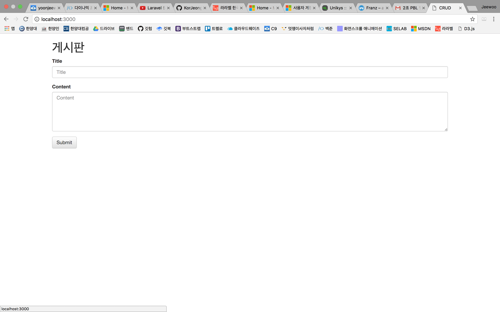
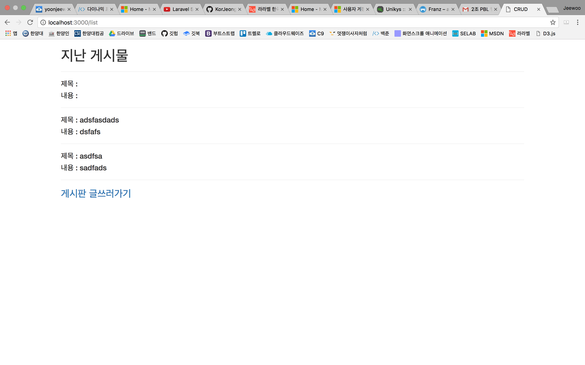
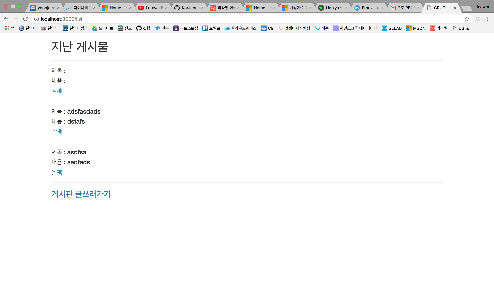
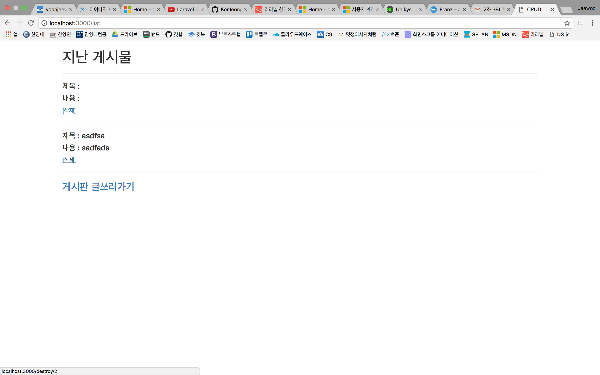

# 170524 CRUD

----

오늘은 대망의 CRUD를 끝냈다.
CRUD만 있으면, 웬만한 어플리케이션은 쉽게 만들 수 있어서, 웹 앱에서는 CRUD가 코어역할을 한다.

우선 지난시간에 배웠던, **C**reate 와 **R**ead까지는 미리 구현을 해놓고 진행을 하겠다.





위와 같이 글을 쓰면, 리스트가 보이는 형태가 되었다.

 자 그럼, 이제 나머지 **U**pdate와 **D**estroy를 진행해보자!
 
 우선 삭제를 먼저 진행을 해보겠다.
 
 그전에 삭제를 하려면, 삭제 버튼이 있어야 하므로, `list.html.erb`에 들어가서 코드를 다음과 같이 수정을 한다. 
 ```erb
 <div class="container">
	<h1>지난 게시물</h1>
	<hr>
	
	<% @posts.each do |post| %>
	<h4>제목 : <%= post.title %></h4>
	<h4>내용 : <%= post.content %></h4>
	<a href="/destroy/<%= post.id %>">[삭제]</a>
	<hr>
	<% end %>
	
	<h3><a href="/">게시판 글쓰러가기</a></h3>
</div>
 ```
 위의 코드에서 *<%=post.id%>* 가 무엇일까?
 
우리가 앞으로 컨트롤하게 될 여러가지 컴포넌트(그냥 Things라고 알아두자)들은 순차적인 id값을 가지고 있다. *예를 들면, 글이 총 3개가 있다면, 첫번째 녀석은 id가 1이고 두번째 녀석 세번째 녀석은 2,3이 되는 것이다.*

그래서 이 개별적인 컴포넌트들에 접근을 하려면, "URL끝에 내가 이 컴포넌트를 선택했소!" 라는 표시를 해주어야 한다.

그것이 방금 보았던, `/destroy/<%= post.id %>`가 되는 것이다.

자 그럼, 이제 destroy URL에 해당하는 기능을 코드로 구현해보자! 

`home_controller.rb`로 가서 다음과 같은 코드를 추가해보자.

```rails
def destroy
  @one_post = Post.find(params[:post_id])
  @one_post.destroy
  redirect_to "/list"
end
```

위의 코드는 방금 보낸 `/destroy/<%= post.id %>` URL에서 날아온 값을 받는 코드이다.

한줄씩 설명하자면, 

- `@one_post = Post.find(params[:post_id])`
방금 보낸 "삭제하고 싶은 글"의 id에 해당하는 글을 DB에서 불러온다.

- `@one_post.destroy`
삭제한다.

- `redirect_to "/list"`
다시 리스트를 보여주는 주소로 리다이렉트 시킨다.

이다.

그리고 마지막으로, (destroy의 마지막^^)
`routes.rb`에 다음과 같은 코드를 한 줄 추가하면 끝!
`get 'destroy/:post_id' => "home#destroy"`

이제 리스트 화면으로 가서 삭제를 눌러보자!


### 삭제를 눌렀다!

### 삭제가 되었다!

## 자 이제 대망의 Update만 남았다. 

CRUD인데 D를 먼저한 이유가 있다. U는 총 두가지 일을 해줘야 되기 때문!

- 업데이트할 항목 선택
- 수정하고 업데이트

자 그럼 마지막 Update를 진행해보자!

우선, `list.html.erb`를 에 다음과 같은 코드를 한줄 추가하자!
`<a href="/update_view/<%= post.id %>">[수정]</a>`
이제 수정 버튼이 만들어졌을 것이다.

아까 설명한대로, 위의 코드로 인해서 수정하고 싶은 글의 id가 URL로 전송되었다. 
그렇다면, 그 코드의 처리는 controller와 routes에서 해줘야한다.

우선 `routes.rb`부터 수정하자.

다음과 같은 코드를 추가한다.
`get 'update_view/:post_id' => "home#update_view"`

그리고 다음은 `home_controller.rb`에 접근하여 코드를 추가한다.
```rails
def update_view
  @one_post = Post.find(params[:post_id])
end
```
**자 이렇게 되면, 내가 수정하고 싶은 글의 id가 post형태로 라우트로 넘어가서 라우트가 다시 컨트롤러에게 신호를 보내서 이제 컨트롤러가 update_view의 페이지에 선택한 글에 대한 정보를 뿌릴 준비가 된 것이다.**

그래서 위의 정보를 뿌릴 페이지가 있어야 하므로, `update_view.html.erb`를 `/views/home`에 새로 만들고 다음과 같이 코드를 작성한다.

```rails
<div class="container">
	<h1>게시판</h1>
	<form action="/real_update/<%= @one_post.id %>" method="POST">
	  <div class="form-group">
	    <label for="exampleInputEmail1">Title</label>
	    <input name="title" type="text" class="form-control" id="exampleInputEmail1" value="<%= @one_post.title %>">
	  </div>
	  <div class="form-group">
	    <label for="exampleInputPassword1">Content</label>
	    <textarea name="content" class="form-control" rows="5" id="comment" value="<%=@one_post.content%>"></textarea>
	  </div>
	  <button type="submit" class="btn btn-default">Submit</button>
	</form>
</div>
```
다른건 우선 신경쓰지말고, input태그의 value를 잘보면, 내가 선택한 글의 제목과 내용이 DB에서 끌어올라와져 있음을 확인할 수 있다.

자, 그럼 이제 글을 수정을 하고, Update를 해야된다.
`form`태그의 `action`을 살펴보면 `/real_update/<%= @one_post.id %>`를 볼 수 있는데, 이는 실제로 업데이트를 하는 명령을 URL을 통해 하는 것이다.

## 물론, 똑같이 컨트롤러와 라우트를 손봐야한다.

`routes.rb`

```ruby
Rails.application.routes.draw do
  get 'home/index'
  root 'home#index'

  post '/write' => 'home#write'

  get '/list' => 'home#list'
  get 'update_view/:post_id' => "home#update_view"
  get 'destroy/:post_id' => "home#destroy"
  # 추가된 코드
  post 'real_update/:post_id' => "home#real"
  # For details on the DSL available within this file, see http://guides.rubyonrails.org/routing.html
end
```
`home_controller.rb`
```ruby
class HomeController < ApplicationController
  def index

  end
  def write
  	new_post = Post.new

  	new_post.title = params[:title]
  	new_post.content = params[:content]

  	new_post.save

  	redirect_to "/list"
  end
  def list
  	@posts = Post.all.order("id desc")
  end
  def destroy
  	@one_post = Post.find(params[:post_id])
  	@one_post.destroy
  	redirect_to "/list"
  end
  def update_view
  	@one_post = Post.find(params[:post_id])
  end
  def real
  	@one_post = Post.find(params[:post_id])
  	@one_post.title = params[:title]
  	@one_post.content = params[:content]
  	@one_post.save
  	redirect_to "/list"
  end
end

```

# THE END